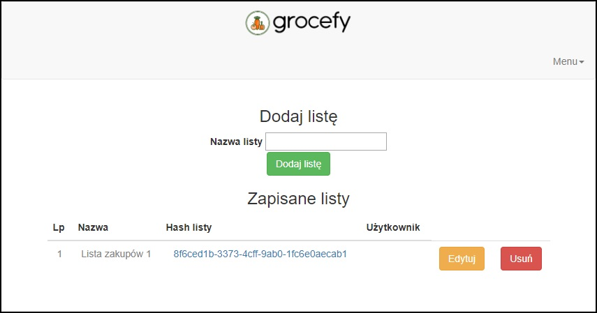
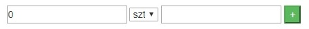
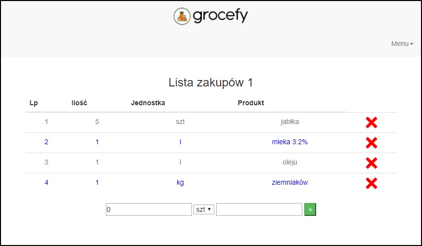

# Grocefy

## Lista zakupów którą możesz się podzielić z innymi! 

Aplikacja pozwala na stworzenie własnej listy zakupów, dodawanie produktów wraz z ilością oraz dzielenia się tą listą z innymi tak by mogli również dodawać wpisy.

Celem aplikacji jest ułatwienie użytkownikowi robienie zakupów, co pozwoli mu zaoszczędzić czas.

#### Link do aplikacji

www.grocefy.herokuapp.com

#### Wygląd głównego menu aplikacji

#### Jak używać aplikacji

Funkcje w aplikacji są samoopisujące, by jak najbardziej ułatwić użytkownikowi korzystanie z aplikacji.

Podczas pierwszego uruchomienia należy stworzyć nową listę. W tym celu należy podać nazwę listy oraz nacisnąć przycisk 'Dodaj listę.'

Po dodaniu zostanie ona wyświetlona w sekcji 'Zapisane listy'. Aby edytować listę należy kliknąć 'Edytuj':

Używając panelu dodaj produkty do listy:

Dodane produkty można usuwać używając symbolu X

Możesz podzielić się swoją listą kopiując link do listy i wysłać go do innej osoby.

