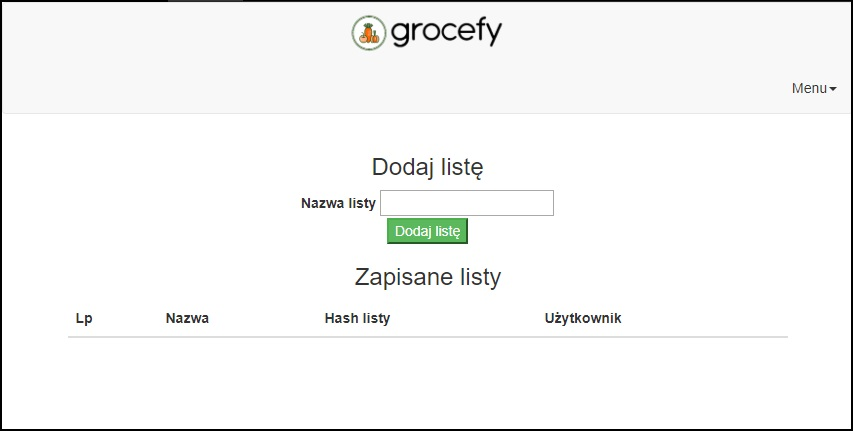

# Grocefy

## Lista zakupów którą możesz się podzielić z innymi! 

Aplikacja pozwala na stworzenie własnej listy zakupów, dodawanie produktów wraz z ilością oraz dzielenia się tą listą z innymi tak by mogli również dodawać wpisy.

Celem aplikacji jest ułatwienie użytkownikowi robienie zakupów, co pozwoli mu zaoszczędzić czas.

#### Link do aplikacji

www.grocefy.herokuapp.com

#### Wygląd głównego menu aplikacji

#### Jak używać aplikacji

Funkcje w aplikacji są samoopisujące, staraliśmy się jak najbardziej ułatwić użytkownikowi korzystanie z aplikacji.
Podczas pierwszego uruchomienia należy stworzyć nową listę. W tym celu należy nacisnąć przycisk 'Dodaj listę.'

